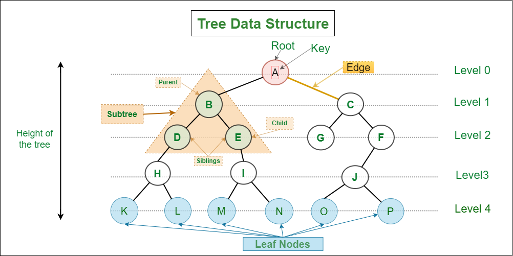

# Trees

To finish this lesson, we will be learning about one of the most efficient ways to store data, by using Trees. There are many different types of Trees, but today will learn about one of the simpler ones, the Binary Search Tree (BST). Trees are data structures that look like a web of branches instead of a single list like queues or sets. The BST is a type of Binary Tree (meaning a tree where each node has at most 2 children) and is a special type of Binary Tree because values in the left subtree are less than the node's value and values in the right subtree are greater. If this sounds confusing, don't worry. Let's breakdown what everything means and show you an example.

### Terms to Know

- Tree- a data structure to store values in nodes
- Node- value in a tree, can be a parent node, child node, or both
- Parent - a node that has other nodes branching off of it
- Child - a node that comes from another node
- Root - the top node in a tree, has no parent node
- Leaf - the last node in a line of a tree, has no children
- Subtree - a section of a tree that could be a tree on its own
- Height - how far away a node is from the root, marked by levels, root is level 0, its children level 1, etc.



It is important to know that Trees are not balanced on their own. A balanced tree is one that has it's leaf nodes on a similar level. Imagine a tree with all the nodes to left, that would just be a List! Lists have an efficienct of O(n), while balanced trees are much better with O(log(n)). This is because balanced trees are "smart" algorithms and as such programmers need to do some complex coding to keep trees balanced. For Binary Search Trees, the 2 most common ways to keep a tree balanced is to by either using a Red-Black Tree or an AVL Tree.

### Balancing Algorithms

- Red-Black Tree- a Tree balancing algorithm that gives nodes an additional attribute (color). Nodes alternate from red to black and uses a number of rules, such as all roots and children being black, no red to red parent/children, and every path from a node to it's leaf nodes having the same amount of black nodes. You don't need to understand how it works exactly, but it is an algorithm to keep a BST balanced

- AVL Tree- the other BST balancing algorithm that instead of using colors, checks to see if any leaf is 2 or more levels away, rotates the nodes to keep the Tree balanced, but still following the Search Tree rules of left smaller, right bigger.


## When to use a Binary Search Tree

Honestly, Trees are very efficient, but a bit complicated so there aren't many example where using a Tree wouldn'y be a good idea. It's important to remember that O(log(n)) is less efficient than O(n) at small numbers. The difference is so slight that you normally don't need to worry about that, but if you are working with small data. The time investment to create a Tree and even more time to implement a balancing algorithm might be not be a great idea. If you can do a job quickly with stacks, queues, sets, or linked lists, you might want to use them. With that being said, if you are working with rapidly changing data, large amounts of data, or both, a Tree will dramatically speed things up.

Some real world examples where people usually use trees is in databases, file systems, and machine learning. These tasks are some of the most important parts of Computer Science, so it's important to not run away from Trees. While they are many more kinds of Trees, each with their own complexity, taking the time to learn and use Trees with dramatically increase your value as a programmer.


## Example/ How to use Trees

To start off I will show you how to create a basic Binary Tree, it will not be balanced or a Binary Search Tree. The problem later will be to fix that.

To create a Tree, we will first make 2 classes, the BinaryTree and the Node. Remember this example is of a "dumb" algorithm. The nodes are randomly thrown into either the left or right and there are no checks for duplicates.

```csharp
public class Node
{
    public int Value { get; set; }
    public Node? Left { get; set; }
    public Node? Right { get; set; }

    public Node(int value)
    {
        Value = value;
    }

    public void Insert(int value)
    {
        if (value != Value)
        {
            Random rnd = new Random();
            int randNum = rnd.Next(1,11);
            if (randNum <= 5)
            {
                if (Left is null)
                    Left = new Node(value);
                else
                    Left.Insert(value);
            }
            else 
            {
                if (Right is null)
                    Right = new Node(value);
                else
                    Right.Insert(value);
            }
        }
    }

    public void InOrderTraversal()
    {
        if (Left != null) Left.InOrderTraversal();
        Console.Write(Value + " ");
        if (Right != null) Right.InOrderTraversal();
    }
}

public class BinaryTree{
    private Node? _root;

    public void Insert(int value) {
        if (_root is null)
            _root = new Node(value);
        else
            _root.Insert(value);
    }
    public void InOrderTraversal()
    {
        if (_root != null)
        {
            _root.InOrderTraversal();
        }
    }
}
class Program
{
    static void Main()
    {
        Console.WriteLine("Binary Tree (random node placement)");

        BinaryTree tree = new BinaryTree();

        tree.Insert(8);
        tree.Insert(3);
        tree.Insert(4);
        tree.Insert(7);
        tree.Insert(4);

        Console.WriteLine("In-order Traversal:");
        tree.InOrderTraversal();
    }
}
```

If you look closely, you'll see that Insert function randomly picks a number 1-10 and if it's 1-5, then it inserts to the left, otherwise to the right. That means the Tree will randomly form, and there is no order to nodes like one of the example Trees shown in the picture below. You can run the program yourself at [BinaryTree_Example](./ds3-example/Program.cs). Try running it a few times and you'll see the different orders.


## Problem: Processing Orders

Please do your work in this file: [Problem](ds3-problem/Program.cs)

This problem doesn't involve the Paper Company, since it is more complex, you simply need to smarten up the Binary Tree and turn it into Binary Search Tree. You will implement 3 functions into the Node.cs file: Insert, FindMin, and FindMax. This assignment is tricky, but you can still do it. You will need to use recurssion (looping over the same function over and over again) in order to complete this problem. If you need more than 20 lines of code, you're doing it wrong.

Requirements:

- Solve the 3 missing functions.
- Make sure Insert puts smaller than parent values into left nodes and larger than parent values into right.
- Run the program and make sure it matches.

When you are finished, you should see this in the terminal

```
Binary Search Tree (smart placement)
In-order Traversal:
3 4 7 8 
Minimum value in the tree: 3
Maximum value in the tree: 8
```
(Please don't look at solution until you have tried on your own first)

You can check your code with the solution here: [Solution](ds3-solution/Program.cs)


[Back to Welcome Page](0-welcome.md)

Overview, explanation, example, solution